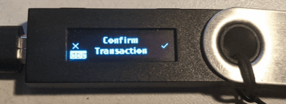

[](https://opensource.org/licenses/Apache-2.0) [](https://opensource.org/licenses/Apache-2.0)

# Hive Application for the Ledger Nano S/X Hardware Wallet


---

Hive wallet application framework for Ledger Nano S/X

When installed on a Ledger Nano S/X device, this application will deserialize transactions and display them on the hardware wallet for secure validation by the user. If the user accepts the transaction, this application will then sign the transaction with the key specified by the user.

There is a pre-compiled binary available in the bin/ folder and attached to each public Github release. However, you may optionally choose to compile the Hive Ledger Nano S/X application manually with help of the provided [run script](run.sh). Usage instructions and examples are contained within this README as well as in the `test/` folder.

## Latest Stable Release
`https://github.com/netuoso/ledger-app-hive/releases/tag/v1.0.0`

## Building the Development Version
- Clone this repository
    - `git clone https://github.com/netuoso/ledger-app-hive`
- Install Docker if not already installed
    - `./run.sh install_docker`
- Pull the latest ledger-app-hive docker image
    - `./run.sh update`
- Start the Docker container
    - `./run.sh start`
- Build the ledger-app-hive application
    - `./run.sh build`

## Building and loading the App with Ledger-Vagrant
This works only for  Ledger Nano S with 1.6.x Firmware installed.
To use it, you will need [Vagrant](https://www.vagrantup.com) and [VirtualBox](https://www.virtualbox.org).
For USB passthrough, VirtualBox Extension Pack should also be installed.

```
git clone https://github.com/christophersanborn/ledger-vagrant
cd ledger-vagrant
vagrant up
```
You can now connect with
```
vagrant ssh
```
You need the following packages
```
sudo apt-get install libsecp256k1-dev  libffi-dev automake libgmp-dev  build-essential libtool python3-pkgconfig
SECP_BUNDLED_EXPERIMENTAL=1 python3 -m pip --no-cache-dir install --no-binary secp256k1 secp256k1
pip3 install ledgerblue
```
Clone the source code with:
```
cd apps/
git clone https://github.com/netuoso/ledger-app-hive
```
and compile it with:
```
cd apps/ledger-app-hive
make clean
make
```
Connect your Nano S and enter your pin. Now you can upload the app with:
```
make load
```
A `make delete` removes it again.
The following shuts down the machine (from the host)
```
vagrant halt
```

## Loading the Development App on a Ledger Nano S
- *you must use Python 3.7 for loading*
- Connect the Ledger Nano S to your computer
- Install the Ledger python module
    - `pip install ledgerblue`
- Load the application onto the Ledger Nano S
    - `./run.sh load`

## Testing the Application
- *you must use Python 2.7 for these scripts*
- Navigate to the test directory
    - `cd test`
- Run the `getPublicKey.py` script
    - `python getPublicKey.py`
- Run the `signTransaction.py` script
    - `python signTransaction.py`

## Example Testing Output
- getPublicKey:

```
Public key compressed 03d3ead6a886a5896dd05f546704761228c14d6b8d306fa7b0945f75df678b6193
Calculated from public key: Address STM8SZg3gBcuAEkz9xGKVMnwJHWESHcXFYWDbRcSBCz322dH6jPwy
Received from ledger: Address STM8SZg3gBcuAEkz9xGKVMnwJHWESHcXFYWDbRcSBCz322dH6jPwy
```
- signTransaction:

```
HID => d40400007205800000308000000d8000000080000000800000000420000000000000000000000000000000000000000000000000000000000000000004021b88040485342c6304048164b85e040101042302086e65747479626f74076e6574756f736f010000000000000003535445454d000000040100
HID <= 1f636611993e469a3ad201fbe40df36e8c2be55378a3ca338654f3844d80ce2d6d32a27448c4e5d5e63707f1b9164b42e8cf29f052ae72bd12609182c9d8c88c389000
1f636611993e469a3ad201fbe40df36e8c2be55378a3ca338654f3844d80ce2d6d32a27448c4e5d5e63707f1b9164b42e8cf29f052ae72bd12609182c9d8c88c38
```

## Technical Application Spec
- [ledger-app-hive Technical Documentation](doc/hiveapp.asc)

## Contributing
If you are interested in contributing the to ledger-app-hive repository, you will need a Github account. Ensure that you have compiled the application, have it installed on your Ledger Nano S/X, and/or throughly read this README and visited the relevant links before filing an issue.

## Bug Reports
If you encounter an issue while using the ledger-app-hive application on a Ledger Nano S/X Device, visit the [issues pages](https://github.com/netuoso/ledger-app-hive/issues) and leave a detailed issue with all necessary information to assist with debugging.
